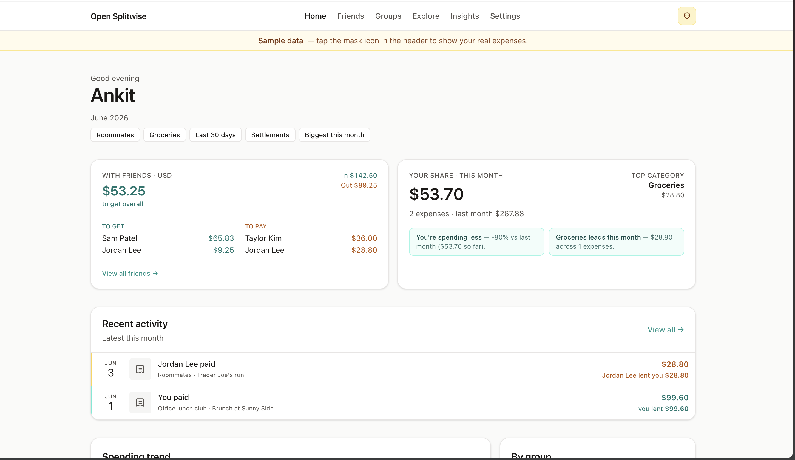

# Open Splitwise

[Splitwise](https://splitwise.com) handles expense splitting well, but offers limited search, export, and analysis across groups and time periods.

This project syncs your Splitwise expenses into a **self-hosted** Postgres database. You can search, filter, export, and visualize them in a web UI you control. Expense entry and settlement remain in Splitwise; this application is a read-focused layer on top of your existing data.



## The goal

**You own a queryable copy of your Splitwise data.**

- Full-text search across descriptions and comments
- Filters, saved views, CSV export
- Insights and balance views across friends and groups
- OAuth connect — token never leaves the server
- One deployment, multiple Splitwise accounts, data isolated per user

This is not a Splitwise replacement. It provides query and analysis over data you already have.

## Quick start (local demo)

No Splitwise account is required. Enable guest demo mode to explore the UI with sample data before configuring OAuth.

```bash
git clone https://github.com/ankitchouhan1020/open-splitwise.git
cd open-splitwise
cp .env.example .env.local
```

Add a session secret (paste the output into `.env.local`):

```bash
openssl rand -base64 32
```

Enable the guest demo:

```bash
echo "DEMO_MODE=true" >> .env.local
```

Start the development server:

```bash
pnpm install
pnpm local
```

Open **http://localhost:3000**, select **Try demo**, and review `/explore` and `/insights`.

To use your own data, configure Splitwise OAuth as described below.

## Connect Splitwise (local)

1. Create an OAuth app at [secure.splitwise.com/apps](https://secure.splitwise.com/apps)
2. Set redirect URI to `http://localhost:3000/api/auth/splitwise/callback`
3. Add `SPLITWISE_CLIENT_ID` and `SPLITWISE_CLIENT_SECRET` to `.env.local`
4. Restart → **Connect Splitwise** → **Sync**

When connected, the **mask icon** in the header toggles between your synced data and sample fixtures, useful for demos or screenshots without disconnecting.

## Hosting

### Docker

Runs the application and Postgres; migrations execute on container start:

```bash
cp .env.example .env
# SESSION_SECRET, SPLITWISE_*, APP_URL
docker compose up --build
```

### Railway

Deploy using Railway's built-in `*.up.railway.app` HTTPS domain. A Cloudflare tunnel is not required for this setup.

**1. Create the project**

1. [railway.app](https://railway.app) → **New Project** → **Deploy from GitHub repo** → select this repository.
2. Railway builds from the root [`Dockerfile`](Dockerfile) ([`railway.toml`](railway.toml) sets the health check).
3. In the same project: **+ New** → **Database** → **PostgreSQL**.

**2. Generate a public URL**

1. Open the app service → **Settings** → **Networking**.
2. **Generate Domain** and copy the URL (e.g. `https://open-splitwise-production-xxxx.up.railway.app`).

**3. Set environment variables**

On the **app** service → **Variables**. Set these **before** the first successful deploy; the application will not start without them:

| Variable                  | Value                                                               |
| ------------------------- | ------------------------------------------------------------------- |
| `APP_URL`                 | Your Railway domain (no trailing slash)                             |
| `NEXT_PUBLIC_APP_URL`     | Same as `APP_URL`                                                   |
| `SPLITWISE_REDIRECT_URI`  | `{APP_URL}/api/auth/splitwise/callback`                             |
| `SPLITWISE_CLIENT_ID`     | From [secure.splitwise.com/apps](https://secure.splitwise.com/apps) |
| `SPLITWISE_CLIENT_SECRET` | From Splitwise                                                      |
| `SESSION_SECRET`          | Output of `openssl rand -base64 32`                                 |
| `DATABASE_URL`            | `${{Postgres.DATABASE_URL}}`                                        |

Do **not** set `PORT` — Railway injects the listen port automatically. Do **not** set `DEMO_MODE` in production.

**4. Splitwise OAuth**

1. Create an OAuth app at [secure.splitwise.com/apps](https://secure.splitwise.com/apps).
2. Add the **exact** redirect URI from the table above (must match `SPLITWISE_REDIRECT_URI` character-for-character).

**5. Deploy and verify**

1. Deploy (or redeploy after variables are set). Migrations run automatically on start.
2. Wait for the health check: `GET /api/health` → `{ "ok": true }`.
3. Open your Railway URL → **Settings** → **Connect Splitwise** → **Sync**.

**Custom domain (optional)** — Railway **Networking** → add your domain, then update `APP_URL`, `NEXT_PUBLIC_APP_URL`, `SPLITWISE_REDIRECT_URI`, and the Splitwise app redirect URI to match.

**Troubleshooting**

| Symptom                    | Fix                                                                                                      |
| -------------------------- | -------------------------------------------------------------------------------------------------------- |
| Application fails to start | Verify **Variables**: `SESSION_SECRET` (32+ characters), `APP_URL`, and `SPLITWISE_REDIRECT_URI` are set |
| OAuth redirect mismatch    | `SPLITWISE_REDIRECT_URI`, Splitwise app, and `APP_URL` must share the same origin                        |
| Database connection errors | Use `${{Postgres.DATABASE_URL}}` on the app service (not `DATABASE_PUBLIC_URL`)                          |

### Cloudflare Tunnel (optional)

For a custom hostname without public inbound ports, see [docs/cloudflare-tunnel.md](docs/cloudflare-tunnel.md). That configuration requires `PORT=3000` on Railway because the tunnel origin targets port 3000.

Env reference: [`.env.example`](.env.example)

## Development

Next.js 15 App Router, Drizzle, iron-session, Splitwise API v3.0.

```bash
pnpm local          # postgres + migrate + dev
pnpm typecheck      # types
pnpm lint           # eslint + prettier
pnpm test           # vitest
```

Conventions for contributors and agents: [`AGENTS.md`](AGENTS.md)

```
src/app/       pages + API routes
src/lib/       sync, queries, splitwise client, auth
drizzle/       migrations
```

Health: `GET /api/health` → `{ "ok": true }`

## License

[MIT](LICENSE)
