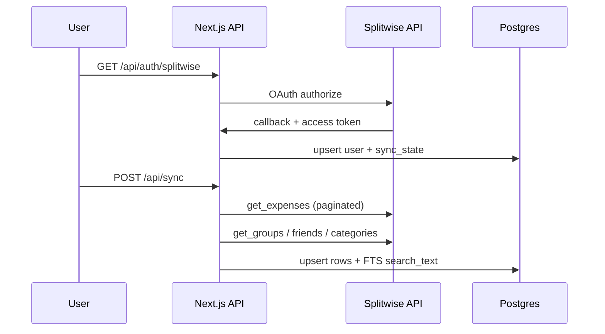
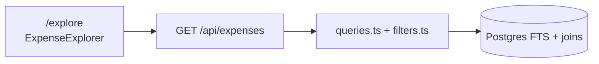

# Open Splitwise

Self-hosted companion for [Splitwise](https://splitwise.com): sync your data locally, then search, filter, and chart expenses. Settling up and splitting still happen in Splitwise.

## Deploy to Railway

[](https://railway.com/new/template/open-splitwise?utm_medium=integration&utm_source=button&utm_campaign=open-splitwise)

One click provisions **PostgreSQL**, **open-splitwise**, and **cloudflared** (see [`deploy/railway-template.json`](deploy/railway-template.json)).

> **Maintainers:** refresh via **Generate Template from Project** (visual editor — no JSON paste) — [docs/railway-template.md](docs/railway-template.md).

**The template wires:**

| Service | Notes |
| ------- | ----- |
| **Postgres** | `DATABASE_URL` reference |
| **open-splitwise** | Dockerfile + [`railway.toml`](railway.toml); `PORT=3000`, `HOSTNAME=::` |
| **cloudflared** | `deploy/cloudflared` — set `TUNNEL_TOKEN` at deploy |

**You still need to:**

1. **`TUNNEL_TOKEN`** — Cloudflare tunnel connector token; point the tunnel hostname at `open-splitwise.railway.internal:3000` ([cloudflare-tunnel.md](docs/cloudflare-tunnel.md)).
2. **Splitwise OAuth** — `SPLITWISE_CLIENT_ID` / `SECRET` from [secure.splitwise.com/apps](https://secure.splitwise.com/apps).
3. **`APP_URL` + `SPLITWISE_REDIRECT_URI`** — your Cloudflare hostname (not `*.up.railway.app` when using the tunnel).
4. Open the site → **Settings** → **Connect Splitwise** → **Sync**.

### App-only Railway deploy

If you prefer to add Postgres yourself:

[](https://railway.com/new/github?owner=ankitchouhan1020&repo=open-splitwise&utm_medium=integration&utm_source=button&utm_campaign=open-splitwise-app)

Then add **PostgreSQL**, set `DATABASE_URL=${{Postgres.DATABASE_URL}}`, and the variables from [`.env.example`](.env.example).

## Setup (local)

**Requirements:** Node 20+, pnpm 9+, Postgres 16

### 1. Environment

```bash
cp .env.example .env.local
```

| Variable                         | Purpose                                                                                   |
| -------------------------------- | ----------------------------------------------------------------------------------------- |
| `SESSION_SECRET`                 | Random string (`openssl rand -base64 32`) — no `$(...)` in the file                       |
| `DATABASE_URL`                   | Postgres connection string                                                                |
| `SPLITWISE_CLIENT_ID` / `SECRET` | From [secure.splitwise.com/apps](https://secure.splitwise.com/apps)                       |
| `SPLITWISE_REDIRECT_URI`         | OAuth callback URL; must match Splitwise app exactly. Takes precedence when set.          |
| `APP_URL`                        | Public app URL (server-only, runtime). Preferred in Docker/Railway over `NEXT_PUBLIC_*`   |
| `NEXT_PUBLIC_APP_URL`            | Optional; baked at build time. Use `APP_URL` if redirect/callback URLs look wrong in prod |

### 2. Database

```bash
docker compose up postgres -d   # or any Postgres 16+
pnpm install
pnpm db:migrate                 # loads .env.local automatically
```

### 3. Run

```bash
pnpm dev          # http://localhost:3000
```

Connect in **Settings** → **Sync now** to pull expenses.

**Sample data toggle:** When connected, use the **mask icon** in the header to swap real expenses for fictional sample data (stays logged in). Set `DEMO_MODE=true` to also show a **Try demo** button for guests without Splitwise.

**Security:** All `/api/*` routes except health, OAuth, and demo start require a valid Splitwise session cookie (or an active demo session). `/explore` and `/insights` redirect to Settings if not connected.

**Multi-tenant:** several Splitwise accounts can share one deployment; data is isolated per `splitwiseUserId` / `account_user_id` (see `src/lib/db/account.ts`). Per-tenant sync locks in `src/lib/sync/lock.ts`.

**Disconnect vs data:** **Disconnect** clears only the session cookie. Synced Postgres rows stay until you use **Delete synced data** in Settings → Privacy & data (or `POST /api/account/delete-synced-data`). Reconnecting restores access to cached data.

**Cloudflare Tunnel:** Step-by-step Railway + Cloudflare guide with platform, setup, and security flowcharts: [docs/cloudflare-tunnel.md](docs/cloudflare-tunnel.md).

```bash
pnpm typecheck && pnpm lint && pnpm test
```

**Health:** `GET /api/health` → `{ "ok": true }`

### Deploy elsewhere

| Target      | How                                                                                  |
| ----------- | ------------------------------------------------------------------------------------ |
| **Railway** | [Deploy to Railway](#deploy-to-railway) (template: app + Postgres)                 |
| **Railway + Tunnel** | [Deploy to Railway](#deploy-to-railway), then [docs/cloudflare-tunnel.md](docs/cloudflare-tunnel.md) (steps 3–8) |
| **Docker**  | `docker compose up --build` — app + Postgres, migrations on start                    |
| **Docker + Cloudflare Tunnel** | No public ports — see [docs/cloudflare-tunnel.md](docs/cloudflare-tunnel.md) |

With a tunnel, set `APP_URL` and `SPLITWISE_REDIRECT_URI` to your Cloudflare hostname (e.g. `https://split.example.com`) and remove Railway public domains so traffic only enters via the tunnel.

```bash
# Self-hosted with tunnel (set TUNNEL_TOKEN in .env first)
docker compose -f docker-compose.yml -f docker-compose.tunnel.yml up -d --build
```

---

## Architecture

```text
Browser ──► Next.js (App Router)
              ├── Pages: /, /explore, /insights, /settings
              └── API routes: /api/*
                        │
         ┌──────────────┼──────────────┐
         ▼              ▼              ▼
   iron-session   Drizzle ORM   SplitwiseClient
   (OAuth token)      │          (API v3.0 + retries)
                      ▼
                 PostgreSQL
                 (users, expenses, groups, friends,
                  categories, sync_state, saved_filter_views)
```

| Layer               | Location                           |
| ------------------- | ---------------------------------- |
| UI                  | `src/app/`, `src/components/`      |
| HTTP API            | `src/app/api/`                     |
| Business logic      | `src/lib/`                         |
| Schema & migrations | `src/lib/db/schema.ts`, `drizzle/` |

---

## Code flow

### Connect & sync



1. **OAuth** — `src/lib/splitwise/oauth.ts` → token stored in encrypted cookie (`src/lib/session.ts`).
2. **Sync** — `POST /api/sync` runs `src/lib/sync/expenses.ts` and `metadata.ts`; progress in `sync_state`.
3. **Incremental sync** — `updated_after` from last run; rate limits handled in `src/lib/splitwise/client.ts`.

### Explore (search & filters)



- URL query params hold filter state (`src/lib/expenses/filters.ts`).
- Search uses Postgres `tsvector` on description, details, and synced comments.
- Saved views: `GET/POST /api/saved-views` → `saved_filter_views` table.

### Insights

- **Page:** `/insights` → `GET /api/insights`
- **Aggregations:** `src/lib/expenses/insights.ts` (my `owed_share`, payments excluded by default)

### Create expense

- **Form** on `/explore` → `POST /api/expenses` → Splitwise `create_expense` (equal split) → local upsert.

### Key paths

| Flow                   | Entry                                        |
| ---------------------- | -------------------------------------------- |
| List / filter expenses | `src/lib/expenses/queries.ts`                |
| Expense detail         | `GET /api/expenses/[id]`                     |
| CSV export             | `GET /api/expenses/export`                   |
| Splitwise deep links   | `src/lib/splitwise/urls.ts`                  |
| DB tenant scope        | `src/lib/db/account.ts` (`account_user_id` per Splitwise user) |

---

## License

Add your license when you publish the app.
