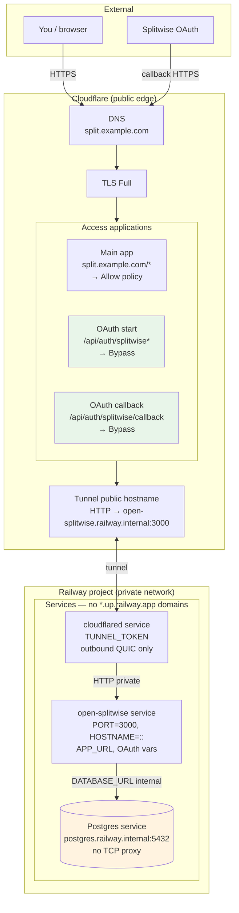
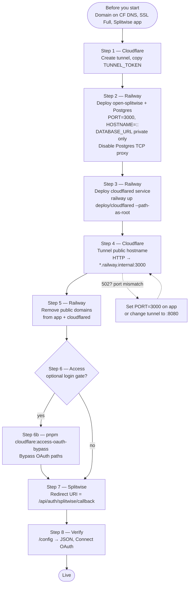
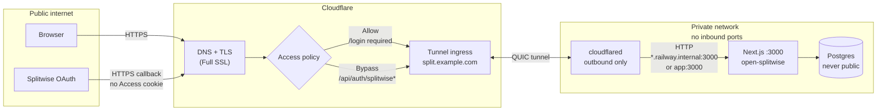
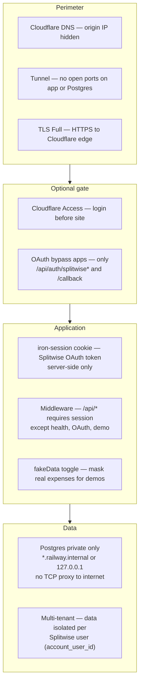

# Cloudflare Tunnel setup guide

Expose open-splitwise over HTTPS **without opening inbound ports**. Traffic flows outbound from `cloudflared` to Cloudflare's edge, then to your app on a private network.

Pick **Railway** (managed hosting) or **Docker Compose** (self-hosted). Both paths share the same Cloudflare tunnel and OAuth steps at the end.

## Railway + Cloudflare setup (diagrams)

### Platform layout

What runs where after setup. Nothing on Railway has a **public HTTP domain**; only Cloudflare faces the internet.



| Component | Public? | Role |
| --------- | ------- | ---- |
| Cloudflare DNS + tunnel | Yes | HTTPS entry; hides Railway IPs |
| `cloudflared` (Railway) | No inbound | Maintains outbound tunnel to Cloudflare |
| `open-splitwise` (Railway) | No | Next.js app; reachable only via `*.railway.internal` |
| Postgres (Railway) | **No** — disable TCP proxy | Data store; `DATABASE_URL` only, never `DATABASE_PUBLIC_URL` |

### Setup sequence

Follow these steps in order for **Railway + Cloudflare** (maps to sections below).



---

## Network & security overview

### Request path (production with tunnel + Access)



### Security layers



| Layer | What it does | Configured in |
| ----- | ------------ | ------------- |
| Tunnel | Outbound-only path to the app; blocks direct Railway/Docker exposure | Steps 1, 3–5 |
| Access (optional) | Login wall for humans | Step 6 |
| OAuth bypass | Lets Splitwise reach callback without Access JWT | Step 6b / `pnpm cloudflare:access-oauth-bypass` |
| App session | OAuth token in encrypted cookie; never sent to client JS | `SESSION_SECRET`, Settings → Connect |
| API middleware | Rejects unauthenticated API calls | Built into app |
| Sample data | Hides real expenses when mask icon is on | Header toggle / `DEMO_MODE` |

---

## Before you start

You will need:

| Item | Notes |
| ---- | ----- |
| **Domain on Cloudflare DNS** | Nameservers pointed at Cloudflare ([full setup](https://developers.cloudflare.com/dns/zone-setups/full-setup/)) |
| **SSL/TLS mode** | Cloudflare dashboard → **SSL/TLS** → **Overview** → **Full** (not Flexible) |
| **Splitwise OAuth app** | [secure.splitwise.com/apps](https://secure.splitwise.com/apps) — you will set the redirect URI in step 8 |
| **Public hostname** | Example: `split.example.com` — used for `APP_URL` and the tunnel |

Generate a session secret once:

```bash
openssl rand -base64 32
```

---

## Step 1 — Create the Cloudflare tunnel

1. Open [Cloudflare Zero Trust](https://one.dash.cloudflare.com/) → **Networks** → **Tunnels**.
2. **Create a tunnel** → connector type **Cloudflared**.
3. Name it (e.g. `open-splitwise`) → **Save tunnel**.
4. On the install page, choose environment **Docker**.
5. Copy the install command and extract **only the token**:

   ```text
   docker run cloudflare/cloudflared:latest tunnel --no-autoupdate run --token <COPY_THIS_PART>
   ```

6. Keep this browser tab open — you will add the public hostname in step 4 or 3b.

---

## Step 2 — Deploy the app

### Option A: Railway

**2a. Create the project**

1. Use **[Deploy on Railway](../README.md#deploy-to-railway)** (full template: app + Postgres), or [Railway](https://railway.com) → **New Project** → deploy from this GitHub repo.
2. Add **PostgreSQL** to the project (Railway plugin).
3. Name the app service `open-splitwise` (or note the name you use).

**2b. Set environment variables** on the **open-splitwise** service:

| Variable | Value |
| -------- | ----- |
| `APP_URL` | `https://split.example.com` (your public hostname — no trailing slash) |
| `NEXT_PUBLIC_APP_URL` | same as `APP_URL` |
| `SPLITWISE_REDIRECT_URI` | `https://split.example.com/api/auth/splitwise/callback` |
| `SPLITWISE_CLIENT_ID` | from Splitwise |
| `SPLITWISE_CLIENT_SECRET` | from Splitwise |
| `SESSION_SECRET` | output of `openssl rand -base64 32` |
| `DATABASE_URL` | reference Postgres: `${{Postgres.DATABASE_URL}}` |
| `PORT` | `3000` |
| `HOSTNAME` | `::` |

> **Why `PORT=3000`?** Railway injects `PORT=8080` by default, but the tunnel origin in step 4 uses port **3000**. If these do not match, you get **502** errors (`connection refused` in cloudflared logs).

**2c. Secure Postgres (important)**

Railway can expose Postgres to the **public internet** via a TCP proxy (`DATABASE_PUBLIC_URL` → `*.proxy.rlwy.net`). The app only needs the **private** URL.

1. **Postgres** service → **Settings** → **Networking** → remove any **TCP proxy** / public Postgres endpoint.
2. On **open-splitwise**, set `DATABASE_URL` to the **private** reference only:

   ```text
   ${{Postgres.DATABASE_URL}}
   ```

   (`postgres.railway.internal:5432` — not `DATABASE_PUBLIC_URL` or `*.proxy.rlwy.net`.)

3. If a public TCP proxy was ever enabled, **rotate the Postgres password** in Railway (Postgres → Variables → regenerate) since the old endpoint may have been discoverable.

**2d. Deploy** and wait until the service is healthy. In logs you should see:

```text
Network: http://[::]:3000
```

Note the private domain from Railway variables: `RAILWAY_PRIVATE_DOMAIN` (e.g. `open-splitwise.railway.internal`).

---

### Option B: Docker Compose (self-hosted)

**2a. Configure env**

```bash
cp .env.example .env
```

Edit `.env`:

```bash
TUNNEL_TOKEN=<paste-token-from-step-1>
SESSION_SECRET=<openssl rand -base64 32>
APP_URL=https://split.example.com
NEXT_PUBLIC_APP_URL=https://split.example.com
SPLITWISE_REDIRECT_URI=https://split.example.com/api/auth/splitwise/callback
SPLITWISE_CLIENT_ID=...
SPLITWISE_CLIENT_SECRET=...
# DATABASE_URL uses compose defaults
```

**2b. Start with the tunnel overlay** (app and Postgres are not published to the host):

```bash
docker compose -f docker-compose.yml -f docker-compose.tunnel.yml up -d --build
```

For local dev **without** a tunnel, use `docker compose up -d` instead.

---

## Step 3 — Run cloudflared

### Option A: Railway (GitHub repo — recommended)

Connects `deploy/cloudflared` from this repo. Required for the [Railway template](../docs/railway-template.md) and for **Generate Template** snapshots (CLI `railway up` uploads cannot be templated).

1. In the same Railway project: **New** → **GitHub Repo** → `ankitchouhan1020/open-splitwise`
2. Name the service `cloudflared`. Set **Root Directory** to `deploy/cloudflared`.
3. **Variables** → `TUNNEL_TOKEN` = token from step 1.
4. Wait for deploy. Logs should show `Registered tunnel connection` and connectivity pre-checks **PASS**.

Or via CLI after `railway link`:

```bash
railway add --repo ankitchouhan1020/open-splitwise --service cloudflared
# set Root Directory deploy/cloudflared in the service Settings if the CLI did not
railway variable set TUNNEL_TOKEN="<paste-token-from-step-1>" --service cloudflared
```

**Do not** run `railway domain` on the cloudflared service — that creates an unwanted public `*.up.railway.app` URL.

### Option A2: Railway (CLI upload)

One-off deploy only; cannot be included in a Railway template snapshot.

```bash
railway link
railway service cloudflared
railway up deploy/cloudflared --path-as-root
railway variable set TUNNEL_TOKEN="<paste-token-from-step-1>" --service cloudflared
```

> Run `railway up` from the **repo root** with `--path-as-root`. Do **not** `cd deploy/cloudflared && railway up`.

---

### Option B: Docker Compose

`cloudflared` is already started by the compose command in step 2b. Check logs:

```bash
docker compose -f docker-compose.yml -f docker-compose.tunnel.yml logs -f cloudflared
```

---

## Step 4 — Public hostname (Cloudflare dashboard)

Back on the tunnel page from step 1 (connector should show **Healthy**):

1. **Configure** → **Public Hostname** → **Add a public hostname**.
2. Set:

   | Field | Railway | Docker Compose |
   | ----- | ------- | -------------- |
   | **Subdomain** | `split` (or your choice) | same |
   | **Domain** | your zone | same |
   | **Path** | *(empty)* | *(empty)* |
   | **Type** | **HTTP** | **HTTP** |
   | **URL** | `open-splitwise.railway.internal:3000` | `app:3000` |

   Use your actual `RAILWAY_PRIVATE_DOMAIN` value for Railway. **Type must be HTTP** — Cloudflare terminates HTTPS; the tunnel talks to the origin in plain HTTP on the private network.

3. **Save tunnel**.

Open `https://split.example.com` — you should see the app (or Cloudflare Access login if you added that in step 5).

---

## Step 5 — Remove Railway public domains (Railway only)

Traffic should enter **only** via the tunnel, not Railway's generated URLs.

1. **open-splitwise** service → **Settings** → **Networking** → remove any public/custom domains.
2. **cloudflared** service → same — remove any `*.up.railway.app` domain if one was created.

Verify DNS points at Cloudflare, not Railway:

```bash
dig +short split.example.com
# Should show Cloudflare IPs (e.g. 104.21.x.x), not Railway
```

---

## Step 6 — Cloudflare Access (optional login gate)

Skip this step if you do not want a login wall in front of the app.

**6a. Protect the whole site**

1. [Zero Trust](https://one.dash.cloudflare.com/) → **Access** → **Applications** → **Add an application** → **Self-hosted**.
2. **Application domain:** `split.example.com`, **Path:** *(empty)*
3. Add an **Allow** policy (e.g. your email, Google, or OTP).
4. **Save**.

Unauthenticated visitors will redirect to the Access login page — that is expected.

**6b. OAuth bypass (required if you use Access)**

Splitwise OAuth hits `/api/auth/splitwise` and `/api/auth/splitwise/callback` **without** an Access cookie. You need two extra Access apps with **Bypass** policies. Use the automated script (recommended):

**Create an API token:** Cloudflare → **My Profile** → **API Tokens** → **Create Token** → **Edit Cloudflare Zero Trust** template (or custom: Access Apps and Policies **Edit**, Account Settings **Read**).

Add to `.env.local`:

```bash
CLOUDFLARE_API_TOKEN=...
CLOUDFLARE_ACCOUNT_ID=...    # Zero Trust sidebar
APP_URL=https://split.example.com
```

Run:

```bash
pnpm cloudflare:access-oauth-bypass
pnpm cloudflare:access-oauth-bypass -- --verify
```

The script creates (idempotent):

| App | Path | Policy |
| --- | ---- | ------ |
| `open-splitwise OAuth start` | `/api/auth/splitwise*` | Bypass + Everyone |
| `open-splitwise OAuth callback` | `/api/auth/splitwise/callback` | Bypass + Everyone |

**Verify:** In a private window, `https://split.example.com/api/auth/splitwise/config` returns **JSON** (status 200), not a redirect to `cloudflareaccess.com`. The home page should still require Access login.

<details>
<summary>Manual dashboard fallback (no API token)</summary>

1. **Access** → **Applications** → **Add** → **Self-hosted** twice.
2. App 1: domain `split.example.com`, path `/api/auth/splitwise*`, policy **Bypass** + **Everyone**.
3. App 2: domain `split.example.com`, path `/api/auth/splitwise/callback`, policy **Bypass** + **Everyone**.
4. Leave the main site app (empty path) on **Allow**.

</details>

---

## Step 7 — Splitwise OAuth

1. [Splitwise app settings](https://secure.splitwise.com/apps) → your app.
2. Set **Redirect URI** to exactly:

   ```text
   https://split.example.com/api/auth/splitwise/callback
   ```

3. Confirm Railway / `.env` has the same `SPLITWISE_REDIRECT_URI` and `APP_URL`.
4. Redeploy if you changed env vars.

---

## Step 8 — Test end-to-end

| Check | Expected |
| ----- | -------- |
| `curl -sI https://split.example.com/api/health` | 200 or 302 to Access (if step 6 enabled) |
| `curl -s https://split.example.com/api/auth/splitwise/config` | JSON with `effective` redirect URI (200; no Access redirect if step 6b done) |
| App logs | `Network: http://[::]:3000` |
| cloudflared logs | `Registered tunnel connection`, no `connection refused` |
| In browser (after Access login) | **Settings** → **Connect Splitwise** completes OAuth |

---

## Troubleshooting

| Symptom | Fix |
| ------- | --- |
| Tunnel connector offline | Check `TUNNEL_TOKEN` (no extra whitespace); cloudflared container running |
| **502** on public URL | Origin port mismatch — set `PORT=3000` on Railway app **or** change tunnel URL to `:8080`; confirm app logs show the same port |
| `connection refused` in cloudflared logs | Set `HOSTNAME=::` on Railway app; confirm `RAILWAY_PRIVATE_DOMAIN:3000` in tunnel hostname |
| OAuth redirect mismatch | `SPLITWISE_REDIRECT_URI`, Splitwise app, and `APP_URL` must all use the same hostname |
| OAuth fails with Access enabled | Run `pnpm cloudflare:access-oauth-bypass -- --verify` |
| Wrong service deployed to cloudflared | Redeploy with `railway up deploy/cloudflared --path-as-root` from repo root |
| Postgres exposed on host | Tunnel compose overlay removes public ports; dev compose binds Postgres to `127.0.0.1` only |
| Postgres reachable from internet | Railway **Postgres → Networking** — disable TCP proxy; use `DATABASE_URL` (internal), never `DATABASE_PUBLIC_URL` |

**Logs:** Railway service logs, or `docker compose … logs cloudflared`.

---

## Security notes

- Never commit `TUNNEL_TOKEN`, `CLOUDFLARE_API_TOKEN`, or `SESSION_SECRET`.
- The tunnel hides your origin IP and avoids port forwarding. Multiple Splitwise users can share one deployment; each session only sees its own synced data. Use Cloudflare Access to limit who can open the site at all.
- Use the **mask icon** (sample data) or `DEMO_MODE` when demoing without showing real expenses.
